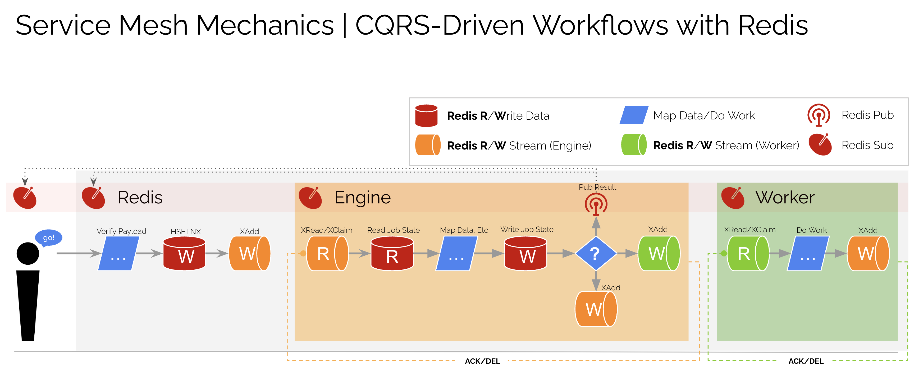
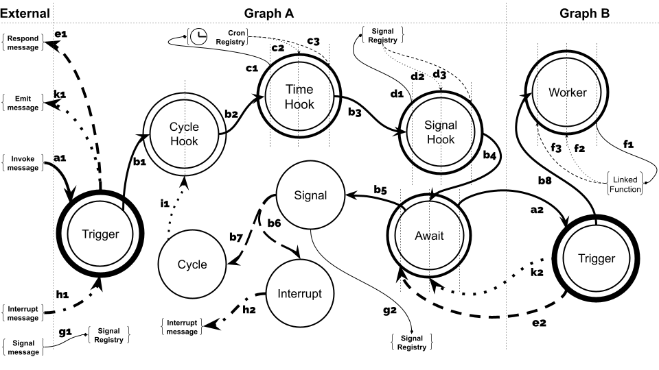

# HotMesh Samples

This repo demonstrates the use of HotMesh in a JavaScript/TypeScript environment.  The [demos](./demos/) are structured to run like unit tests, so as to reveal the full lifecycle of a HotMesh transactional workflow.

If you'd like to know more about *HotMesh* in general, refer to the section on Distributed Orchestration. If you're a Temporal developer, already versed in durable workflow concepts, the *MeshFlow* module will be easiest to understand, given its adherence to Temporal's TypeScript SDK. And if you're interested in hybrid transactional/analytical (HTAP) solutions, refer to *MeshData*.

## Table of Contents

1. [HotMesh](#hotmesh)
   - [Distributed Orchestration](#distributed-orchestration)
   - [Control Without a Controller](#control-without-a-controller)
   - [Model-driven Development](#model-driven-development)
2. [MeshCall](#meshcall)
   - [Connect Everything](#connect-everything)
   - [Link the Cron Function](#link-the-cron-function)
   - [Run the Cron Function](#run-the-cron-function)
2. [MeshFlow](#meshflow)
   - [Transactional Workflow](#transactional-workflow)
   - [Activities](#activities)
   - [Workflows](#workflows)
   - [Client](#client)
   - [Worker](#worker)
3. [MeshData](#meshdata)
   - [Transactional Analytics](#transactional-analytics)
   - [Ad hoc Operational Networks](#ad-hoc-operational-networks)
   - [Connect](#connect)
   - [Execute](#execute)
   - [Execute and Cache](#execute-and-cache)
   - [Execute and Operationalize](#execute-and-operationalize)
5. [Run the Demos](#run-the-demos)
   - [JavaScript Examples](#javascript-examples)
   - [TypeScript Examples](#typescript-examples)
6. [Visualize | Open Telemetry](#visualize--opentelemetry)
6. [Visualize | Redis Insight](#visualize--redisinsight)
6. [Visualize | HotMesh Dashboard](#visualize--hotmesh-dashboard)

## Quickstart

### Requirements
- Docker (Desktop 4.24/Docker Compose 2.22.0)
- Node

### Get started
- `npm run docker:up` - Build
- `npm run open:redis` - Open RedisInsight [password is `key_admin`]
- `npm run docker:reset-redis` - Reset Redis [reset database]
- `npm run docker:logs:redis` - View Redis logs

HotMesh works with any Redis-like backend, including ValKey and Dragonfly. A Docker Compose file has been included for each. If you wish to run the demos using a specific backend, use one of the following variants:

- `npm run docker:reset-redis` - Reset Redis [reset and use Redis]
- `npm run docker:reset-redis:valkey` - Reset ValKey [reset and use ValKey]
- `npm run docker:reset-redis:dragonfly` - Reset Dragonfly [reset and use Dragonfly]

>All demos will work with all DB variants except for the MeshData demo which uses the Redis `FT.SEARCH` module (unsupported in ValKey). The demo will still successfully execute workflows, but it will not be searchable using `FT.SEARCH` commands. 

### JavaScript
Run from outside the Docker container.
- `npm run docker:demo:js:hotmesh howdy` - Run the *HotMesh* lifecycle example (JavaScript)
- `npm run docker:demo:js:meshcall` - Run the *MeshCall* lifecycle example (JavaScript)
- `npm run docker:demo:js:meshflow` - Run the *MeshFlow* lifecycle example (JavaScript)
- `npm run docker:demo:js:meshdata cat dog mouse` - Run the *MeshData* lifecycle example (JavaScript)

### TypeScript
Run from outside the Docker container.
- `npm run docker:demo:ts:hotmesh howdy` - Run the *HotMesh* lifecycle example (TypeScript)
- `npm run docker:demo:ts:meshcall` - Run the *MeshCall* lifecycle example (TypeScript)
- `npm run docker:demo:ts:meshflow` - Run the *MeshFlow* lifecycle example (TypeScript)
- `npm run docker:demo:ts:meshdata cat dog mouse` - Run the *MeshData* lifecycle example (TypeScript)

## HotMesh
### Distributed Orchestration
[HotMesh](https://hotmeshio.github.io/sdk-typescript/classes/services_hotmesh.HotMesh.html) is a distributed modeling and orchestration system capable of encapsulating existing systems, such as Business Process Management (BPM) and Enterprise Application Integration (EAI). The central innovation is its ability to compile its models into Distributed Executables, replacing a traditional Application Server with a network of Decentralized Message Routers.

The following depicts the mechanics of the approach and describes what is essentially a *sequence engine*. Time is an event source in the system, while sequence is the final arbiter. This allows the system to use Redis (or a Redis clone like ValKey) like a balloon, flexibly expanding and deflating as the network adjusts to its evolving workload.



The modeling system is based on a [canonical set](https://zenodo.org/records/12168558) of 9 message types (and corresponding transitions) that guarantee the coordinated flow in the absence of a central controller.



Here, for example, is the `worker` activity type. It's reentrant (most activities are), which allows your linked functions to emit in-process messages as they complete a task. The messaging system goes beyond basic request/response and fan-out/fan-in patterns, providing real-time progress updates.


>Process orchestration is emergent within HotMesh and occurs naturally as a result of processing stream messages. While the reference implementation targets Redis+TypeScript, any language (Rust, Go, Python, Java) and multimodal database (ValKey, DragonFly, etc) can take advantage of the *sequence engine* design pattern.

### Control Without a Controller
HotMesh is designed as a distributed quorum of engines where each member adheres to the principles of CQRS. According to CQRS, *consumers* are instructed to read events from assigned topic queues while *producers* write to said queues. This division of labor is essential to the smooth running of the system. HotMesh leverages this principle to drive the perpetual behavior of engines and workers (along with other advantages described [here](https://github.com/hotmeshio/sdk-typescript/blob/main/docs/distributed_orchestration.md)). 

As long as their assigned topic queue has items, consumers will read exactly one item and then journal the result to another queue. And as long as all consumers (engines and workers) adhere to this principle, sophisticated workflows emerge.

### Model-driven Development
The following YAML represents a HotMesh workflow; it includes a *trigger* and a linked *worker* function. The Sequence Engine will step through these instructions one step at a time once deployed.

```yaml
# myfirstapp.1.yaml
app:
  id: myfirstapp
  version: '1'
  graphs:
    - subscribes: myfirstapp.test
      activities:
        t1:
          type: trigger
        w1:
          type: worker
          topic: work.do
      transitions:
        t1:
          - to: w1
```

>The `work.do` *topic* identifies the worker function to execute. This name is arbitrary and should match the semantics of your use case or your own personal preference.

Call `HotMesh.init` to register a *worker* and *engine*. As HotMesh is a distributed orchestration platform, initializing a point of presence like this serves to give the engine another distributed node. If spare CPU is available on the host machine, the *engine role* will be called upon to coordinate the overall workflow. Similarly, invoking the linked worker function, involves the *worker role*.

```javascript
import * as Redis from 'redis';
import { HotMesh } from '@hotmeshio/hotmesh';

const hotMesh = await HotMesh.init({
  appId: 'myfirstapp',

  engine: {
    redis: {
      class: Redis,
      options: { url: 'redis://:key_admin@redis:6379' }
    }
  },

  workers: [
    { 
      topic: 'work.do',
      redis: {
        class: Redis,
        options: { url: 'redis://:key_admin@redis:6379' }
      }
      callback: async (data: StreamData) => {
        return {
          metadata: { ...data.metadata },
          data: { } //optionally process inputs, return output
        };
      }
    }
  ]
});

await hotMesh.deploy('./myfirstapp.1.yaml');
await hotMesh.activate('1');
const response = await hotMesh.pubsub('myfirstapp.test', {});
//returns {}
```

## MeshCall

### Connect Everything
The [MeshCall](https://hotmeshio.github.io/sdk-typescript/classes/services_meshcall.MeshCall.html) module connects any function with a connection to Redis. Function responses are cacheable and functions can even run as idempotent cron jobs. Make blazing fast interservice calls that return in milliseconds without the overhead of HTTP.

### Link the Cron Function
This example demonstrates an *idempotent* cron that runs every day. The `id` makes each cron job unique and ensures that only one instance runs, despite repeated invocations.

The `cron` method fails silently if a workflow is already running with the same `id`. Optionally set a `delay` and/or set `maxCycles` to limit the number of cycles.

```javascript
//cron.ts
import { MeshCall } from '@hotmeshio/hotmesh';
import * as Redis from 'redis';

export const runMyCron = (id: string, interval = '1 day') => {
  MeshCall.cron({
    topic: 'my.cron.function',
    redis: {
      class: Redis,
      options: { url: 'redis://:key_admin@redis:6379' }
    },
    callback: async () => {
      //your code here...
    },
    options: { id, interval, maxCycles: 24 }
  });
};
```

### Run the Cron Function
Call `runMyCron` at server startup (or call as needed to run multiple crons).

```javascript
//server.ts
import { runMyCron } from './cron';
runMyCron('myDailyCron123');
```

## MeshFlow

### Transactional Workflow
HotMesh's [MeshFlow](https://hotmeshio.github.io/sdk-typescript/classes/services_meshflow.MeshFlow.html) module (included alongside HotMesh in the same NPM package) is modeled after Temporal's developer-friendly SDK. It is a behavioral clone of **both** the Temporal TypeScript SDK and the Temporal backend application server and showcases how HotMesh can redeploy the *functionality* of an app server like Temporal using stateless message routers. And because it's backed by an in-memory data store (Redis), it's a useful drop-in for those use cases that require millisecond-level performance.

Here is the telemetry output for a HotMesh MeshFlow workflow with a linked worker function. Workflows can be designed with completion times in the tens of milliseconds, taking advantage of distributed stateless execution and a clustered Redis backend.


The [HotMesh Schema](https://github.com/hotmeshio/sdk-typescript/blob/main/services/meshflow/schemas/factory.ts) used to emulate the Temporal application server is authored in YAML and describes Temporal as a finite state machine. It can be difficult to read through the YAML, so the following visual depiction has been included. Developers familiar with Temporal should see familiar patterns like *reentry*, *collation*, *composition*, *throttling*, etc. Even though the schema is < 100KB, it produces behavioral fidelity indistinguishable from Temporal's physical application server.


The standard set of expected static workflow methods are available for use in your functions: 

 - `waitFor` Pause your function using your chosen signal key, and only awaken when the signal is received from the outide. Use a standard `Promise` to collate and cache the signals and only awaken your function once all signals have arrived.
    ```javascript
    import { MeshFlow } from '@hotmeshio/hotmesh';
    const { waitFor } = MeshFlow.workflow;

    const [a, b] = await Promise.all([
      waitFor<{payload: string}>('sig1'),
      waitFor<number>('sig2')
    ]);
    ```
 - `signal` Send a signal (and payload) to a paused function awaiting the signal. Signals may also be sent from the outside to awaken a paused function.
    ```javascript
    await MeshFlow.workflow.signal('sig1', {payload: 'hi!'});
    ```
 - `hook` Redis governance converts your functions into 're-entrant processes'. Optionally use the *hook* method to spawn parallel execution threads to augment a running workflow.
    ```javascript
    await MeshFlow.workflow.hook({
      workflowName: 'newsletter',
      taskQueue: 'default',
      args: []
    });
    ```
 - `sleepFor` Pause function execution for a ridiculous amount of time (months, years, etc). There's no risk of information loss, as Redis governs function state. When your function awakens, function state is efficiently (and automatically) restored and your function will resume right where it left off.
    ```javascript
    await MeshFlow.workflow.sleepFor('1 month');
    ```
 - `random` Generate a deterministic random number that can be used in a reentrant process workflow (replaces `Math.random()`).
    ```javascript
    const random = await MeshFlow.workflow.random();
    ```
 - `execChild` Call another meshflow function and await the response. *Design sophisticated, multi-process solutions by leveraging this command.*
    ```javascript
    const jobResponse = await MeshFlow.workflow.execChild({
      workflowName: 'newsletter',
      taskQueue: 'default',
      args: [{ id, user_id, etc }],
    });
    ```
 - `startChild` Call another meshflow function, but do not await the response.
    ```javascript
    const jobId = await MeshFlow.workflow.startChild({
      workflowName: 'newsletter',
      taskQueue: 'default',
      args: [{ id, user_id, etc }],
    });
    ```
 - `getContext` Get the current workflow context (workflowId, replay history, replay index, etc).
    ```javascript
    const context = await MeshFlow.workflow.getContext();
    ```
 - `search` Instance a search session
    ```javascript
    const search = await MeshFlow.workflow.search();
    ```
    - `set` Set one or more name/value pairs
      ```javascript
      await search.set('name1', 'value1', 'name2', 'value2');
      ```
    - `get` Get a single value by name
      ```javascript
      const value = await search.get('name');
      ```
    - `mget` Get multiple values by name
      ```javascript
      const [val1, val2] = await search.mget('name1', 'name2');
      ```
    - `del` Delete one or more entries by name and return the number deleted
      ```javascript
      const count = await search.del('name1', 'name2');
      ```
    - `incr` Increment (or decrement) a number
      ```javascript
      const value = await search.incr('name', 12);
      ```
    - `mult` Multiply a number
      ```javascript
      const value = await search.mult('name', 12);
      ```

Developers already familiar with Temporal will recognize the standard top-level constructs used in the example: `activities`, `workflows`, `workers` and `clients`. Specifically, the example proxies two activities, one of which will throw random errors. But the workflow eventually succeeds as it is a meshflow, reentrant workflow.

### Activities
Start by defining **activities**. They can be written in any style, using any framework, and can even be legacy functions you've already written. *Note how the `saludar` example throws an error 50% of the time. It doesn't matter how unpredictable your functions are, HotMesh will retry as necessary until they succeed.*

```javascript
//activities.ts
export async function greet(name: string): Promise<string> {
  return `Hello, ${name}!`;
}

export async function saludar(nombre: string): Promise<string> {
  if (Math.random() > 0.5) throw new Error('Random error');
  return `¡Hola, ${nombre}!`;
}
```

### Workflows
Define **workflow** logic. Include conditional branching, loops, etc to control activity execution. It's vanilla code written in your own coding style. The only requirement is to use `proxyActivities`, ensuring your activities are executed with HotMesh's durability guarantee.

```javascript
//workflows.ts
import { MeshFlow } from '@hotmeshio/hotmesh';
import * as activities from './activities';

const { greet, saludar } = MeshFlow.workflow
  .proxyActivities<typeof activities>({
    activities
  });

export async function example(name: string, lang: string): Promise<string> {
  if (lang === 'es') {
    return await saludar(name);
  } else {
    return await greet(name);
  }
}
```

### Client
Instance a HotMesh **client** to invoke the workflow.

```javascript
//client.ts
import { MeshFlow, HotMesh } from '@hotmeshio/hotmesh';
import * as Redis from 'redis';

async function run(): Promise<string> {
  const client = new MeshFlow.Client({
    connection: {
      class: Redis,
      options: { url: 'redis://:key_admin@localhost:6379' }
    }
  });

  const handle = await client.workflow.start({
    args: ['HotMesh', 'es'],
    taskQueue: 'default',
    workflowName: 'example',
    workflowId: HotMesh.guid()
  });

  return await handle.result();
  //returns '¡Hola, HotMesh!'
}
```

### Worker
Create a **worker** and link your workflow function. Workers listen for tasks on their assigned Redis stream and invoke your workflow function each time they receive an event.

```javascript
//worker.ts
import { MeshFlow } from '@hotmeshio/hotmesh';
import * as Redis from 'redis';
import * as workflows from './workflows';

async function run() {
  const worker = await MeshFlow.Worker.create({
    connection: {
      class: Redis,
      options: { url: 'redis://:key_admin@localhost:6379' },
    },
    taskQueue: 'default',
    workflow: workflows.example,
  });

  await worker.run();
}
``` 

## MeshData
### Transactional Analytics
For those deployments with the Redis `FT.SEARCH` module enabled, it's possible to deploy [HTAP](https://en.wikipedia.org/wiki/Hybrid_transactional/analytical_processing) solutions using MeshData, enabling millisecond-level *transactional processing* with *real-time analytics*. Even without `FT.SEARCH` enabled, MeshData's easy-to-use, functional style makes it an excellent starting point for both new development and refactoring. Key features include:

- `Easy Integration`: Seamlessly integrates into existing code bases, allowing for the refactoring of legacy systems without extensive overhaul.
- `Ad Hoc Network Creation`: Facilitates the creation of an operational data layer by connecting functions into a single, manageable mesh.
- `MeshFlow Workflow Support`: Supports the transformation of functions into meshflow workflows with Redis-backed persistence.
- `Flexible Function Invocation`: Functions can be called remotely with ease, supporting both cached and uncached execution modes.
- `Workflow Extensions`: Offers a suite of workflow extension methods including hooks for extending functionality, signal handling for inter-process communication, and sleep for delaying execution.
- `Search and Indexing`: Provides tools for managing workflow state and leveraging Redis' search capabilities to query operational data.

### Ad Hoc Operational Networks
The following is a typical microservices network, with a tangled mess of services and functions. There's important business logic in there (functions *A*, *B* and *C* are critical), but it's hard to find and access.


MeshData creates an *ad hoc*, Redis-backed network of functions (an "operational data layer"). It's a simple, yet powerful, way to expose and unify your most important functions into a single mesh.

*Any service with access to Redis can join in the network, bypassing the legacy clutter.*

### Connect
Easily expose your target functions. Here the legacy `getUser` function is registered as `user`.

```javascript
import * as Redis from 'redis'; //or `import Redis from 'ioredis'`
import { MeshData } from '@hotmeshio/hotmesh'

const meshdata = new MeshData(Redis, { url: 'redis://:key_admin@localhost:6379' });

const getUser = async (id: string) => {
  //...fetch user from DB: { id: 'jsmith123', name: 'Jan Smith', ... }
  return user;
}

meshdata.connect({
  entity: 'user',
  target: getUser,
});
```

### Execute
Call connected functions from anywhere on the network with a connection to Redis.

```javascript
import * as Redis from 'redis';
import { MeshData } from '@hotmeshio/hotmesh'

const meshdata = new MeshData(Redis, { url: 'redis://:key_admin@localhost:6379' });

const response = await meshdata.exec({
  entity: 'user',
  args: ['jsmith123'],
});

//returns { id: 'jsmith123', name: 'Jan Smith', ... }
```

### Execute and Cache
Provide an `id` and `ttl` flag in the format `1 minute`, `2 weeks`, `3 months`, etc to cache the function response. This is a great way to alleviate an overburdened database...and it's a familiar pattern for those who already use Redis as a cache.

```javascript
const response = await meshdata.exec({
  entity: 'user',
  args: ['jsmith123'],
  options: { id: 'jsmith123', ttl: '15 minutes' },
});

//returns cached { id: 'jsmith123', name: 'Jan Smith', ... }
```

### Execute and Operationalize
Provide a `ttl` of `infinity` to operationalize the function. It's now a **durable workflow** with all the benefits of Redis-backed governance.

```javascript
const response = await meshdata.exec({
  entity: 'user',
  args: ['jsmith123'],
  options: { id: 'jsmith123', ttl: 'infinity' },
});

//returns cached { id: 'jsmith123', name: 'Jan Smith', ... }
// AND REMAINS ACTIVE!
```

Refer to the [SDK/Docs](https://hotmeshio.github.io/meshdata-typescript/index.html) for a full overview of MeshData's features.

## Run the Demos

### JavaScript Examples

#### Run/Demo HotMesh (JavaScript)
This demo deploys a custom YAML model and a linked worker function to demonstrate the full end-to-end lifecycle.
From within the container:
```bash
npm run demo:js:hotmesh greetings
```
From outside the container:
```bash
npm run docker:demo:js:hotmesh greetings
```

#### Run/Demo MeshCall (JavaScript)
This demo shows interservice function calls with caching support.
From within the container:
```bash
npm run demo:js:meshcall
```
From outside the container:
```bash
npm run docker:demo:js:meshcall
```
#### Run/Demo MeshFlow (JavaScript)
This demo shows a basic durable workflow with support for *retry*. It throws errors 50% of the time and eventually recovers, logging the result of the workflow execution to the log. The retry cycle is set at 5 seconds.
From within the container:
```bash
npm run demo:js:meshflow
```
From outside the container:
```bash
npm run docker:demo:js:meshflow
```

#### Run/Demo MeshData (JavaScript)
This demo runs a few workflows (one for every term you add when starting the test). The app auto-deploys, creates an index, and searches for workflow records based upon terms. The following will create 3 searchable workflows: cat, dog, mouse. The last term entered will be used to drive the FT.SEARCH query. (The following would search for the 'mouse' record after all workflows (cat, dog, and mouse) have started.)
From within the container:
```bash
npm run demo:js:meshdata cat dog mouse
```
From outside the container:
```bash
npm run docker:demo:js:meshdata cat dog mouse
```

### TypeScript Examples

#### Run/Demo HotMesh (TypeScript)
This demo deploys a custom YAML model and a linked worker function to demonstrate the full end-to-end lifecycle.
From within the container:
```bash
npm run demo:ts:hotmesh greetings
```
From outside the container:
```bash
npm run docker:demo:ts:hotmesh greetings
```

#### Run/Demo MeshCall (TypeScript)
This demo shows interservice function calls with caching support.
From within the container:
```bash
npm run demo:ts:meshcall
```
From outside the container:
```bash
npm run docker:demo:ts:meshcall
```

#### Run/Demo MeshFlow (TypeScript)
This demo shows a basic durable workflow with support for *retry*. It throws errors 50% of the time and eventually recovers, logging the result of the workflow execution to the log. The retry cycle is set at 5 seconds.
From within the container:
```bash
npm run demo:ts:meshflow
```
From outside the container:
```bash
npm run docker:demo:ts:meshflow
```

#### Run/Demo MeshData (TypeScript)
This demo runs a few workflows (one for every term you add when starting the test). The app auto-deploys, creates an index, and searches for workflow records based upon terms. The following will create 3 searchable workflows: cat, dog, mouse. The last term entered will be used to drive the FT.SEARCH query. (The following would search for the 'mouse' record after all workflows (cat, dog, and mouse) have started.)
From within the container:
```bash
npm run demo:ts:meshdata cat dog mouse
```
From outside the container:
```bash
npm run docker:demo:ts:meshdata cat dog mouse
```

## Visualize | OpenTelemetry
Add your Honeycomb credentials to `.env`, and view the full *OpenTelemetry* execution tree organized as a DAG.


## Visualize | RedisInsight
View commands, streams, data, etc using RedisInsight.


## Visualize | HotMesh Dashboard
The HotMesh dashboard provides a visual representation of the network, including the number of engines, workers, and workflows. It also provides a real-time view of the network's health and performance, linking to the OpenTelemetry dashboard for more detailed information.

An LLM is also included to simplify querying and analyzing workflow data for those deployments that include the Redis `FT.SEARCH` module.

